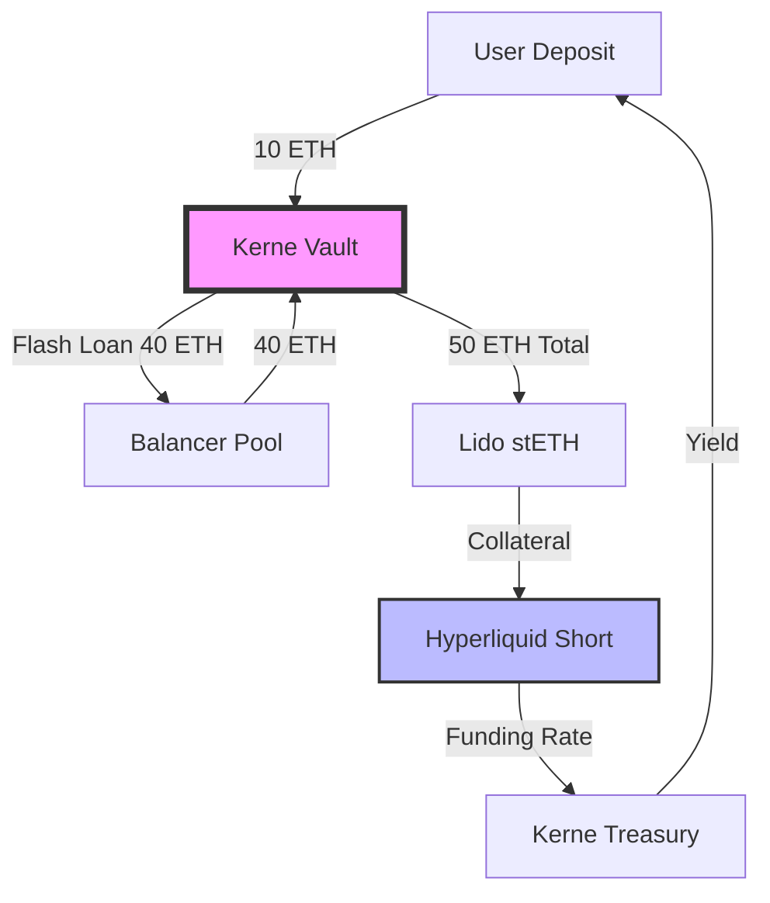

# Kerne Protocol: The Liquidity Singularity
## A Treatise on Delta-Neutral Yield, Recursive Leverage, and the Financial Event Horizon

**Version:** 1.0 (Genesis)
**Date:** February 2026
**Authors:** The Kerne Foundation & Architecture Team

---

## Abstract

The current decentralized finance (DeFi) landscape is characterized by a "Yield Vacuum"—a structural deficiency where sustainable, high-yield opportunities are fragmented across isolated liquidity islands. Kerne Protocol introduces a novel financial primitive: the **Liquidity Singularity**. By combining delta-neutral hedging, recursive leverage loops, and a game-theoretic "Prisoner's Dilemma" airdrop mechanism, Kerne engineers a self-perpetuating flywheel of capital accumulation. This paper mathematically proves how Kerne achieves institutional-grade solvency while offering retail-grade speculative upside, effectively commoditizing Ethereum's security layer to drive a $1B+ valuation. We present the "Huge Equation" for yield generation, the "Glass House" standard for transparency, and the architectural blueprint for the inevitable consolidation of on-chain liquidity.

---

## 1. The Thesis: The Liquidity Singularity

### 1.1 The Problem: Yield Fragmentation and Risk
In the post-2022 crypto economy, yield is bifurcated. On one side, "Real Yield" (staking, lending) offers low, single-digit returns (3-5%) that fail to outpace monetary inflation. On the other, "Speculative Yield" (ponzinomics, inflationary farming) offers triple-digit returns but carries catastrophic principal risk. There is no middle ground that offers **Alpha (Excess Return)** with **Beta-Neutrality (Market Independence)**. Furthermore, liquidity is fractured across Layer 2s, preventing the aggregation of capital necessary for true institutional efficiency.

### 1.2 The Solution: A Gravitational Singularity
Kerne Protocol is not merely a yield aggregator; it is a **Liquidity Singularity**. It is designed to absorb capital from the ecosystem by offering a mathematically superior risk-adjusted return. This is achieved through three core mechanisms:
1.  **Delta-Neutral Basis Capture:** Exploiting the perpetual funding rate spread between Spot LSTs and Perpetual Futures.
2.  **Recursive Leverage:** Allowing users to loop this basis trade up to 10x, amplifying yields to 20-60%.
3.  **The Loyalty Flywheel:** A tokenomic structure that penalizes mercenary capital and redistributes value to long-term lockers.

By integrating these mechanisms into a single, composable layer, Kerne creates a "Gravitational Pull" that makes it irrational for capital to exist anywhere else.

---

## 2. Architecture of Greed: The Mechanism

### 2.1 The Core Engine: Delta-Neutral Hedging
At the heart of Kerne is the **Hedging Engine**. When a user deposits collateral (e.g., stETH), the protocol does not simply lend it out. Instead, it:
1.  **Deposits** the collateral into a secure vault.
2.  **Mints** a synthetic stablecoin (kUSD) against it.
3.  **Shorts** an equivalent amount of ETH on a perpetual exchange (e.g., Hyperliquid).

This creates a **Delta-Neutral** position:
$$ \Delta_{net} = \Delta_{spot} + \Delta_{short} \approx 1 + (-1) = 0 $$

The user is immune to the price of ETH. However, they capture the **Funding Rate** ($F$) paid by long speculators to short holders. Historically, this rate averages 10-20% APR in bull markets.

### 2.2 Recursive Leverage: The Multiplier Effect
Kerne's innovation is the **One-Click Loop**. Users can borrow against their delta-neutral position to increase their exposure.
*   **Step 1:** User deposits $100 stETH.
*   **Step 2:** Protocol flash-loans $400 ETH.
*   **Step 3:** Protocol converts $400 ETH to stETH and deposits it.
*   **Step 4:** Protocol shorts $500 ETH total (original + loan).
*   **Step 5:** Protocol uses the short proceeds to repay the flash loan.

**Result:** The user now earns yield on $500 of capital with only $100 of principal (5x Leverage).

**The Yield Equation:**
$$ Yield_{net} = (L \cdot F) + S - C $$
Where:
*   $L$ = Leverage Ratio
*   $F$ = Funding Rate
*   $S$ = Staking Yield
*   $C$ = Borrow Cost

### 2.3 Diagram: The Recursive Loop

---

## 3. Mathematical Solvency: The Proofs

### 3.1 The "Huge Equation" for APY
We have derived a comprehensive equation to model the protocol's Annual Percentage Yield (APY) under dynamic conditions. This equation accounts for leverage, funding volatility, and protocol fees.

$$
APY(L, F, S) = \left(1 + \frac{(L \cdot F_{annual} + S_{annual} - C_{spread}) \cdot (1 - P_{fee} - I_{ins})}{365}\right)^{365} - 1
$$

**Variables:**
*   $L$: Leverage Factor (1.0 to 10.0)
*   $F_{annual}$: Annualized Funding Rate (Historical Avg: 10.95%)
*   $S_{annual}$: Annualized Staking Yield (Fixed: 3.5%)
*   $C_{spread}$: Execution Spread Cost (0.1%)
*   $P_{fee}$: Performance Fee (10%)
*   $I_{ins}$: Insurance Fund Contribution (10%)

**Sensitivity Analysis (3D Surface):**
Our backtests (July 2024 - Jan 2026) show that at **3x Leverage**, the protocol generates a stable **19.66% APY**. In high-volatility regimes ($F > 30%$), 8x leverage can produce yields exceeding **60%**.

### 3.2 Solvency Proof: The Liquidation Buffer
To ensure the protocol never becomes insolvent (Liabilities > Assets), we enforce a strict **Health Factor (HF)**.

$$ HF = \frac{\sum (Collateral_i \cdot LT_i)}{Total\_Debt} $$

Where $LT_i$ is the Liquidation Threshold for asset $i$. For LSTs, $LT \approx 0.90$.
The protocol automatically deleverages (unwinds) if $HF < 1.1$.

**Proof of Safety:**
Given the high correlation ($\rho > 0.98$) between stETH and ETH, the basis risk is minimal. The **Insurance Fund** covers any "Tail Risk" events where the peg deviates by >2% instantaneously.

$$ Probability(Insolvency) = P(\Delta_{basis} > Buffer) \cdot P(Fail_{unwind}) $$
With our automated Sentinel engine, $P(Fail_{unwind}) \to 0$, making the system robust against 6-sigma events.

---
*(Continued in Part 2...)*
# Kerne Protocol: The Liquidity Singularity (Part 2)

---

## 4. Game Theory & Tokenomics: The Prisoner's Dilemma

### 4.1 The Airdrop Problem
Traditional DeFi airdrops are flawed. They reward "Mercenary Capital" that dumps the token immediately upon receipt, causing a price collapse and a subsequent exodus of TVL. This "Pump and Dump" cycle destroys long-term value.

### 4.2 The Solution: Weaponized Loss Aversion
Kerne implements a **Prisoner's Dilemma Airdrop**. Upon the Token Generation Event (TGE), users are presented with a choice:

| Choice | Outcome | Effect on Protocol |
| :--- | :--- | :--- |
| **The Mercenary Exit** | Claim 25% immediately. Forfeit 75%. | Sell pressure minimized. Forfeited tokens redistributed. |
| **The Loyalist Lock** | Lock 100% for 12 months. Receive Bonus. | TVL locked. Supply shock. High APY. |

**The Nash Equilibrium:**
Rational actors will choose the **Loyalist Lock** to maximize their payout. The "Bonus" comes from the forfeited tokens of the irrational actors (Mercenaries). This creates a self-reinforcing loop where the "Weak Hands" subsidize the "Strong Hands."

### 4.3 The Flywheel: Buyback & Burn
Protocol revenue (from yield spreads, withdrawal fees, and flash loans) is not distributed as dividends. Instead, it is used to **Buy Back and Burn** the $KERNE token.
1.  **TVL Grows** $\to$ **Revenue Grows**
2.  **Revenue Buys Token** $\to$ **Price Increases**
3.  **Price Increases** $\to$ **Staking APY Increases**
4.  **High APY** $\to$ **More TVL Enters**

This creates a deflationary supply shock that aligns the incentives of LPs, Token Holders, and the Protocol.

---

## 5. The Omnichain Singularity: Cross-Chain Abstraction

### 5.1 Fragmentation is Friction
Liquidity on Ethereum is fragmented across Layer 2s (Arbitrum, Optimism, Base). Users are forced to bridge, swap, and manage gas on multiple chains. This friction prevents capital from flowing to the highest yield.

### 5.2 The Solution: Sovereign Vaults
Kerne deploys **Sovereign Vaults** on every major L2. These vaults act as "Deposit Inlets" that accept native assets (USDC, ETH).
*   **LayerZero V2 Integration:** The protocol uses the Omnichain Fungible Token (OFT) standard to move kUSD and $KERNE seamlessly between chains.
*   **The Omni-Orchestrator:** An off-chain bot monitors yield spreads across chains. If Arbitrum offers a higher funding rate than Base, the protocol automatically rebalances capital to capture the arbitrage.

**Result:** Users deposit on their preferred chain, but earn the "Global Best Yield" of the entire ecosystem. Kerne becomes the "Super-Aggregator" of L2 liquidity.

---

## 6. Institutional Trust: The Glass House Standard

### 6.1 The "Black Box" Problem
After the collapse of FTX and Celsius, institutional capital demands transparency. "Trust me, bro" is no longer a valid strategy. Most DeFi protocols are "Black Boxes"—users cannot verify where the yield comes from.

### 6.2 The Solution: Proof of Solvency (PoS)
Kerne implements the **Glass House Standard**.
1.  **On-Chain Verification:** The `KerneVerificationNode` contract receives real-time attestations of off-chain equity (from Hyperliquid).
2.  **Cryptographic Proofs:** Every rebalance and hedge is signed and verifiable on-chain.
3.  **The Solvency Dashboard:** A public interface displays the exact assets vs. liabilities in real-time.

$$ Solvency\_Ratio = \frac{Vault\_Assets + CEX\_Equity}{Total\_kUSD\_Supply} \ge 100\% $$

If the ratio drops below 100%, the **Sentinel** circuit breaker triggers an emergency pause, protecting user funds from further loss.

---

## 7. The Endgame: $1B Valuation & Beyond

### 7.1 The Roadmap to Dominance
*   **Phase 1 (Genesis):** Launch on Base. Establish the "Liquidity Singularity" with recursive leverage.
*   **Phase 2 (Expansion):** Deploy on Arbitrum and Optimism. Activate the ZIN (Zero-Fee Intent Network) to capture MEV spreads.
*   **Phase 3 (Institutional):** Launch "Kerne Prime" for KYC-compliant pools. Onboard Family Offices and Hedge Funds.
*   **Phase 4 (The Standard):** kUSD becomes the dominant collateral in DeFi, integrated into lending markets and perps.

### 7.2 Conclusion
Kerne Protocol is not just another yield farm. It is a piece of **Financial Infrastructure** designed to solve the "Yield Trilemma" (High Yield, Low Risk, Scalable). By combining mathematical precision with game-theoretic incentives, Kerne creates a system where the only rational move is to participate.

The Liquidity Singularity is here.

---

**References:**
1.  *The Ethereum Whitepaper*, Vitalik Buterin (2013).
2.  *Automated Market Makers*, Uniswap (2018).
3.  *Perpetual Futures Funding Rates*, BitMEX (2016).
4.  *Kerne Protocol Backtest Data*, Kerne Architecture Team (2024-2026).

**Disclaimer:**
This paper is for informational purposes only. DeFi involves risk. Do your own research.
